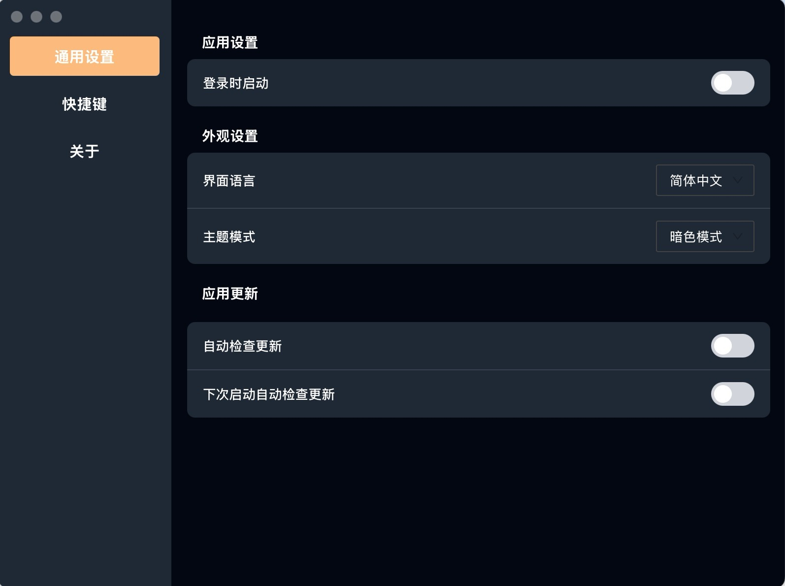
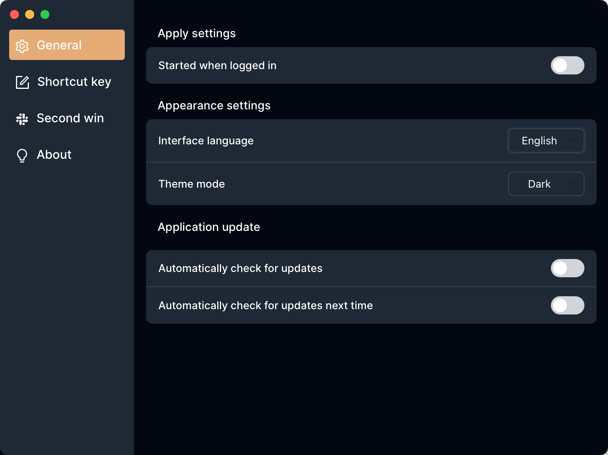
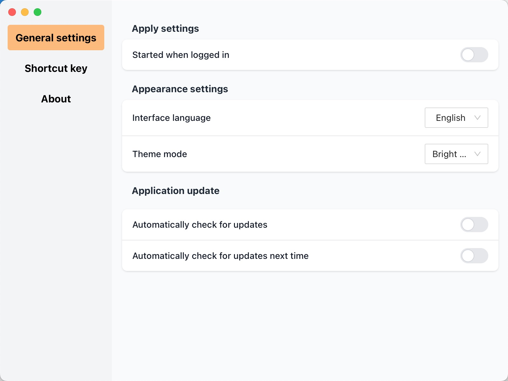

<p align="center"><h1 align="center">SuiDemo</h1></p>

<p align="center">
<a href="https://github.com/JinGongX/SuiDemo?tab=Apache-2.0-1-ov-file">

</a>
<a href="https://github.com/JinGongX/SuiDemo/releases">

</a>
 <a href="https://github.com/wailsapp/wails/tags" rel="nofollow">
    
  </a>
  <a href="https://visitorbadge.io/status?path=https%3A%2F%2Fgithub.com%2FJinGongX%2FSuiDemo"></a>
</p>
<p align="center">
  <a href="#简体中文">简体中文</a> ｜ <a href="#english">English</a>
</p>

## 简体中文

🎯 一个使用 [Wails v3](https://v3alpha.wails.io) 构建的现代桌面应用模板，开箱即用地集成了以下功能：

- 🌍 多语言支持
- 🌗 黑暗 / 明亮主题切换
- 🗂️ SQLite 数据库读写示例（增删改查）
- 🧱 可扩展的前后端架构，适合二次开发
- 🚀 ```wails3 init -n "Your Project Name" -t https://github.com/JinGongX/SuiDemo``` 直接创建项目
---

## 💻 技术栈

| 部分         | 技术                     |
|--------------|--------------------------|
| 前端         | Vue 3 + TypeScript       |
| 样式         | Tailwind CSS             |
| 国际化       | vue-i18n                 |
| 桌面框架     | Wails v3                 |
| 数据库       | SQLite（使用 Go 操作）   |

---

## 🚀 快速开始

### 环境准备

确保你已安装以下依赖：

- [Go 1.21+](https://golang.org/dl/)
- [Node.js 16+](https://nodejs.org)
- [Wails v3 CLI](https://wails.io/docs/gettingstarted/installation)

```bash
# 安装 Wails CLI
go install github.com/wailsapp/wails/v3/cmd/wails@latest

# 运用模版创建项目并运行项目
wails3 init -n myproject -t https://github.com/JinGongX/SuiDemo  
cd myproject

#启动开发模式
wails3 dev

#构建生产包
wails3 package
#构建后的应用在 bin 目录下可找到。
```

## 🧱 项目结构
```
SuiDemo/
├── frontend/             # Vue3 前端代码
│   ├── src/
│   │   ├── locales/         # 多语言资源文件
│   │   ├── components/   # Vue 组件
│   │   └── App.vue
├── services/             # Go 后端服务
├── main.go               # 应用入口
├── Taskfile.yml            # Wails 配置文件
└── go.mod
```
## 📜 许可证

Apache-2.0 License

## 📸 界面展示




## 🙌 鸣谢

[Wails v3](https://v3alpha.wails.io/)

## 💬 联系方式

如果你对这个项目感兴趣或有任何建议，欢迎提 issue 或发邮件联系我 ggfugg8@icloud.com


## English

## 🧩Project Overview

> 🌍 A Wails v3-based desktop application template with i18n, dark mode, and SQLite integration.
- ✅ Internationalization (i18n) using `vue-i18n`
- 🌗 Automatic light/dark theme support with manual override
- 🗃️ SQLite database integration with CRUD operations
- ⚙️ Settings panel and hotkey configuration demo
- 💡 Built with Wails v3, Vue 3, and TypeScript
- 🚀 ```wails3 init -n "Your Project Name" -t https://github.com/JinGongX/SuiDemo``` Create a project
---

## 📦Tech Stack

| Module        | Technology          | Description                                |
|---------------|---------------------|--------------------------------------------|
| Desktop Shell | Wails v3            | Build cross-platform apps using Go + Web   |
| Frontend      | Vue 3 + TypeScript  | Modern reactive frontend framework         |
| Styling       | Tailwind CSS        | Utility-first CSS framework                |
| i18n          | vue-i18n            | Seamless internationalization              |
| Database      | SQLite + Go         | Local storage powered by SQLite and Go     |

## 🚀Getting Started

### 1.Install Dependencies

```bash
# install Wails CLI
go install github.com/wailsapp/wails/v3/cmd/wails@latest

# create project
wails3 init -n myproject -t https://github.com/JinGongX/SuiDemo  
cd myproject

# Run in Dev Mode
wails3 dev

# Build for Production
wails3 package
```

## 🧱 Project Structure

```
SuiDemo/
├── frontend/             # Vue3 code
│   ├── src/
│   │   ├── locales/          
│   │   ├── components/    
│   │   └── App.vue
├── services/             # Go api code
├── main.go                
├── Taskfile.yml            # Wails config
└── go.mod
```
## 📸 Screenshots




## 📜 License

Apache-2.0 License

## 🙌 Acknowledgements

[Wails v3](https://v3alpha.wails.io/)

## 💬 Contact

If you find this useful or have suggestions, feel free to open an issue or reach out.
Email: ggfugg8@icloud.com